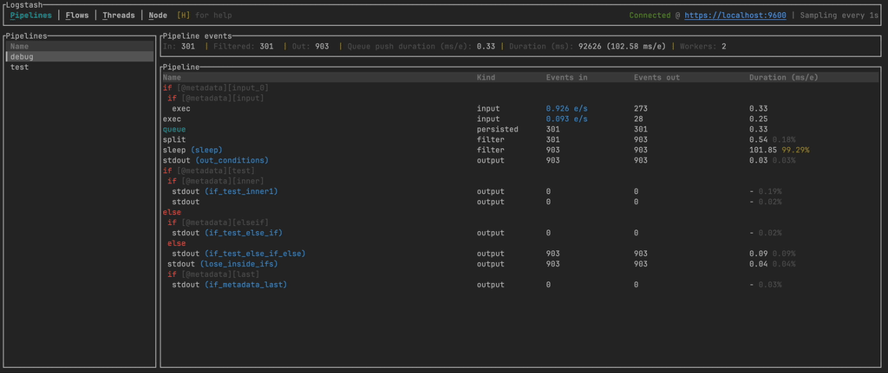

# Tuistash

A Terminal User Interface (TUI) for monitoring Logstash 🪵



## Installation

### Homebrew
```shell
brew tap edmocosta/homebrew-tap
```

```shell
brew install tuistash
```

### Manually
Download the latest release from the [GitHub releases page](https://github.com/edmocosta/tuistash/releases) or build it from the source:

1 - Install Rust and Cargo (Linux and macOS):
```shell
curl https://sh.rustup.rs -sSf | sh
```

2 - Clone the repository:
```shell
git clone https://github.com/edmocosta/tuistash.git
```

3 - Build the binary (`target/release/tuistash`)
```shell
cd tuistash
```

```shell
cargo build --release
```

## Usage

The Logstash's [monitoring API](https://www.elastic.co/guide/en/logstash/current/monitoring-logstash.html) must be enabled
and accessible from the client machine, unless the data is being read from a Logstash diagnostic path.

```shell
$ ./tuistash --help
```

```shell
Usage: tuistash [OPTIONS] [COMMAND]

Commands:
  get   Query data from the Logstash API
  tui   Logstash TUI
  help  Print this message or the help of the given subcommand(s)

Options:
      --host <HOST>                        [default: http://localhost:9600]
      --username <USERNAME>                
      --password <PASSWORD>                
      --skip-tls-verification              
  -p, --diagnostic-path <DIAGNOSTIC_PATH>  Read the data from a Logstash diagnostic path
  -h, --help                               Print help
  -V, --version                            Print version

```

### TUI

```shell
./tuistash
```

```shell
./tuistash tui --help
```

```shell
Logstash TUI

Usage: tuistash tui [OPTIONS]

Options:
  -i, --interval <INTERVAL>    Refresh interval in seconds [default: 1]
```

### Other commands

#### GET

```shell
./tuistash get node --help
```

```shell
Prints the current node information

Usage: tuistash get node [OPTIONS] [TYPES]

Arguments:
  [TYPES]  Valid values are 'node', 'os', 'jvm', 'pipelines' separated by comma

Options:
  -o <OUTPUT> Valid values are 'default', 'json', 'table', 'raw'
```

Examples:

```shell
./tuistash get node pipelines,os
```

```shell
  PIPELINES                                                                                                                                    
  NAME   WORKERS  BATCH_SIZE  BATCH_DELAY  CONFIG_RELOAD_AUTOMATIC  CONFIG_RELOAD_INTERVAL  DLQ_ENABLED  EPHEMERAL_ID                          
  debug  2        125         50           true                     3000000000              false        454ab3a7-92bb-45c6-bef3-91759e20987d  
  
  OS                                                                                                                                           
  NAME   VERSION           ARCH     AVAILABLE_PROCESSORS                                                                                       
  Linux  5.15.49-linuxkit  aarch64  2    
```

```shell
./tuistash get node jvm -o json
```

```shell
{
  "jvm": {
    "gc_collectors": [
      "G1 Young Generation",
      "G1 Old Generation"
    ],
    "mem": {
      "heap_init_in_bytes": 1073741824,
      "heap_max_in_bytes": 1073741824,
      "non_heap_init_in_bytes": 7667712,
      "non_heap_max_in_bytes": 0
    },
    "pid": 1,
    "start_time_in_millis": 1685344376388,
    "version": "17.0.6",
    "vm_name": "OpenJDK 64-Bit Server VM",
    "vm_vendor": "Eclipse Adoptium",
    "vm_version": "17.0.6"
  }
}
```
